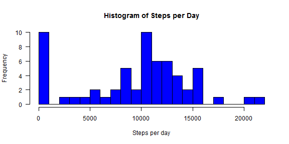
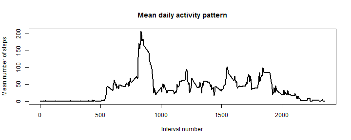
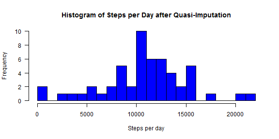
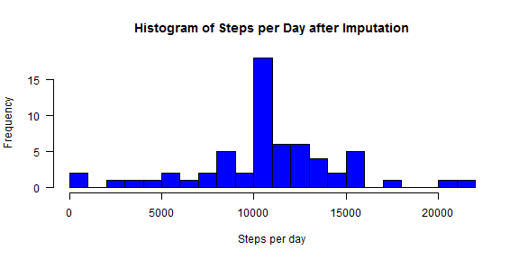
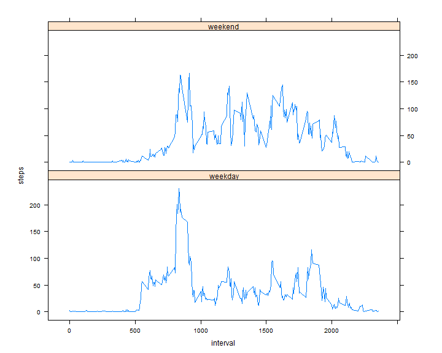

# Reproducible Research: Peer Assessment 1

## Prerequisites

The data used for this analysis was originally downloaded from [https://d396qusza40orc.cloudfront.net/repdata%2Fdata%2Factivity.zip](https://d396qusza40orc.cloudfront.net/repdata%2Fdata%2Factivity.zip). The following script assumes that the downloaded data file is named `activity.zip` and resides in the current R working directory. 

## Loading and preprocessing the data

The following chunk unzips the data file and loads the data into the variable `dat.all`. It includes a comment that I used to set the working directory the first time I run the script on my local machine.

Additionally, it also adds a new variable `dateposix` which transforms the string variable `date` into a POSIX format.


```r
## setwd('C:/data-sync/coursera/data-scientist-05-reproducible-research/assignment/RepData_PeerAssessment1')

## unzip the file
unzip(zipfile = "activity.zip")
dat.all <- read.csv("activity.csv", stringsAsFactors = FALSE)
dat.all$dateposix <- as.POSIXct(strptime(dat.all$date, format = "%Y-%m-%d"))
```


After loading, the data looks like this:


```r
head(dat.all)
```

```
##   steps       date interval  dateposix
## 1    NA 2012-10-01        0 2012-10-01
## 2    NA 2012-10-01        5 2012-10-01
## 3    NA 2012-10-01       10 2012-10-01
## 4    NA 2012-10-01       15 2012-10-01
## 5    NA 2012-10-01       20 2012-10-01
## 6    NA 2012-10-01       25 2012-10-01
```

```r
tail(dat.all)
```

```
##       steps       date interval  dateposix
## 17563    NA 2012-11-30     2330 2012-11-30
## 17564    NA 2012-11-30     2335 2012-11-30
## 17565    NA 2012-11-30     2340 2012-11-30
## 17566    NA 2012-11-30     2345 2012-11-30
## 17567    NA 2012-11-30     2350 2012-11-30
## 17568    NA 2012-11-30     2355 2012-11-30
```

```r
set.seed(42)
dat.all[sort(sample(1:nrow(dat.all), size = 6)), ]
```

```
##       steps       date interval  dateposix
## 5027      0 2012-10-18     1050 2012-10-18
## 9117     NA 2012-11-01     1540 2012-11-01
## 11272    NA 2012-11-09      315 2012-11-09
## 14587     7 2012-11-20     1530 2012-11-20
## 16072    71 2012-11-25     1915 2012-11-25
## 16462     0 2012-11-27      345 2012-11-27
```


## What is mean total number of steps taken per day?

To answer this question, we first have to calculate the sum of steps for each day. We do this using the `tapply()` function. Note that we exclude missing values, as specified in the instructions to this assignment.


```r
steps.per.day <- tapply(dat.all$steps, dat.all$dateposix, sum, na.rm = TRUE)
head(steps.per.day)
```

```
## 2012-10-01 2012-10-02 2012-10-03 2012-10-04 2012-10-05 2012-10-06 
##          0        126      11352      12116      13294      15420
```


We can visualize this data by generating a histogram, using the `hist()` function.


```r
hist(steps.per.day, col = "blue", nclass = 20, main = "Histogram of Steps per Day", 
    xlab = "Steps per day", las = 1)
```

 


Then we can easily calculate the mean and the median over this sum:


```r
(steps.mean <- mean(steps.per.day))
```

```
## [1] 9354
```


```r
(steps.median <- median(steps.per.day))
```

```
## [1] 10395
```


So, according to this analysis, the subject in question has made a mean number of 9354.2295 steps per day, but the median number of steps is 10395. This (as well as the high number of zeros and very low numbers seen in the histogram) indicate that the data is skewed -- the mean is probably not the best way of expressing the central tendency. (Or, that we shouldn't have used the sum when there are missing values -- see below).

## What is the average daily activity pattern?

To answer this question according to the assignment instructions, we first calculate the mean number of steps over all days for each interval. Despite not being explicitly mentioned in the assignment instructions, the missing values are removed from the following analysis. 


```r
steps.per.interval <- tapply(dat.all$steps, dat.all$interval, mean, na.rm = TRUE)
head(steps.per.interval)
```

```
##       0       5      10      15      20      25 
## 1.71698 0.33962 0.13208 0.15094 0.07547 2.09434
```


We then plot the time series of the mean daily activity pattern. We use the `names()` function to retrieve the interval number.


```r
plot(steps.per.interval ~ names(steps.per.interval), type = "l", lwd = 2, main = "Mean daily activity pattern", 
    xlab = "Interval number", ylab = "Mean number of steps")
```

 


Next, we want to find the interval with the maximum number of steps in this mean daily activity pattern.


```r
wch.max <- which(steps.per.interval == max(steps.per.interval))
(max.steps <- steps.per.interval[wch.max])
```

```
##   835 
## 206.2
```

```r
(max.steps.interval <- names(max.steps))
```

```
## [1] "835"
```


The interval with the maximum number of steps is interval number 835, where the subject in question made 206.1698 steps, on average.

## Imputing missing values

### Quasi-Imputation

As a first proxy to what the imputed data could look like, we can just omit using the `sum()` function. Instead, we can just use the mean and multiply it with the length of the corresponding vector. This is technically the same as imputing the missing values with the mean.


```r
steps.per.day <- tapply(dat.all$steps, dat.all$dateposix, function(i) mean(i, 
    na.rm = TRUE) * length(i))
head(steps.per.day)
```

```
## 2012-10-01 2012-10-02 2012-10-03 2012-10-04 2012-10-05 2012-10-06 
##        NaN        126      11352      12116      13294      15420
```


We can again plot a histogram:


```r
hist(steps.per.day, col = "blue", nclass = 20, main = "Histogram of Steps per Day after Quasi-Imputation", 
    xlab = "Steps per day", las = 1)
```

 


And we can also calculate mean and median of the quasi-imputed data:


```r
(steps.mean <- mean(steps.per.day, na.rm = TRUE))
```

```
## [1] 10766
```


```r
(steps.median <- median(steps.per.day, na.rm = TRUE))
```

```
## [1] 10765
```


Already with this quasi-imputation, the data looks much less skewed.

### A little more sophisticated two-step imputation

In the following chunk, a new data set `dat.all.impute` is created by copying the original data set. Then, the missing values are imputed by using the mean activity pattern from above, as a (very) rough approximation.


```r
## create a new data set that is identical to the old one:
dat.all.impute <- dat.all

## find out where the missing values are:
wch.impute <- which(is.na(dat.all.impute$steps))

## which is the interval for which the value is missing:
wch.interval <- dat.all[wch.impute, "interval"]

## get the average number of steps for that interval (has to use as character
## to use the names() element!)  and use these values to impute:
dat.all.impute$steps[wch.impute] <- steps.per.interval[as.character(wch.interval)]

## 
sum(is.na(dat.all.impute$steps))
```

```
## [1] 0
```


After that, the number of missing values for the `steps` variable is zero -- There are no missing values left after imputation.

Just to make sure, we can check how big the correlation of the imputed data is with the real data, of course only comparing the imputations that don't actually happen, as we need non-missing real data to calculate the correlation.


```r
## calculate the imputation for all values (not just the missing ones):
steps.impute.all <- steps.per.interval[as.character(dat.all$interval)]

## correlate with real data:
cor(steps.impute.all, dat.all$steps, use = "complete.obs")
```

```
## [1] 0.3446
```


To see if the data now looks differently, We can again compute the steps per day. For computing the sum, we can now omit the `na.rm=TRUE` parameter, as there are no missing values in the data:


```r
steps.per.day <- tapply(dat.all.impute$steps, dat.all$dateposix, sum)
head(steps.per.day)
```

```
## 2012-10-01 2012-10-02 2012-10-03 2012-10-04 2012-10-05 2012-10-06 
##      10766        126      11352      12116      13294      15420
```

We can again plot a histogram:


```r
hist(steps.per.day, col = "blue", nclass = 20, main = "Histogram of Steps per Day after Imputation", 
    xlab = "Steps per day", las = 1)
```

 


And we can also calculate mean and median of the imputed data:


```r
(steps.mean <- mean(steps.per.day))
```

```
## [1] 10766
```


```r
(steps.median <- median(steps.per.day))
```

```
## [1] 10766
```


So, according to this analysis, the subject in question has made a mean number of 1.0766 &times; 10<sup>4</sup> steps per day, and the median number of steps is 1.0766 &times; 10<sup>4</sup>. The median is pretty close to the mean, and also the histogram suggests that the data is much less skewed after imputation.


## Are there differences in activity patterns between weekdays and weekends?

To answer this question, first we create two additional variables: The day of the week `weekday` (which we don't need here, but it might come in handy for other analyses), and the `daytype`, which is either *weekend* or *weekday*. Just for the sake of completeness, we add those two new variables both to the original and the imputed dataset. Note that we have to change the locale for the script to run in different locales, as the `weekdays()` function will return locale-specific strings.


```r
## set the locale, so that the weekdays are always in English
Sys.setlocale(category = "LC_TIME", locale = "US")
```

```
## [1] "English_United States.1252"
```

```r

## make two new variables: weekday and daytype
dat.all.impute$weekday <- weekdays(dat.all.impute$dateposix, abbreviate = TRUE)
dat.all.impute$daytype <- ifelse(dat.all.impute$weekday %in% c("Sat", "Sun"), 
    "weekend", "weekday")

## also add them to the original dataset:
dat.all$weekday <- weekdays(dat.all$dateposix, abbreviate = TRUE)
dat.all$daytype <- ifelse(dat.all$weekday %in% c("Sat", "Sun"), "weekend", "weekday")
```


After that, we can answer the question of whether the activity patterns are different for weekdays and weekends.

For that, we compute the mean number of steps per interval and per type of day:


```r
steps.per.interval.wd <- tapply(dat.all.impute$steps, list(dat.all.impute$interval, 
    dat.all.impute$daytype), mean)
head(steps.per.interval.wd)
```

```
##    weekday  weekend
## 0  2.25115 0.214623
## 5  0.44528 0.042453
## 10 0.17317 0.016509
## 15 0.19790 0.018868
## 20 0.09895 0.009434
## 25 1.59036 3.511792
```

Since we need the data in long format (and not in wide format, as returned by `tapply()`) for plotting it with the `lattice` package (or, at least, I do, because I think there is a way to do that with some kind of formula syntax to do that), we reshape the data using the `melt()` function in the ´reshape2` package:


```r
library(reshape2)
dat.plot <- melt(steps.per.interval.wd)
names(dat.plot) <- c("interval", "daytype", "steps")
head(dat.plot)
```

```
##   interval daytype   steps
## 1        0 weekday 2.25115
## 2        5 weekday 0.44528
## 3       10 weekday 0.17317
## 4       15 weekday 0.19790
## 5       20 weekday 0.09895
## 6       25 weekday 1.59036
```


Now we can easily plot it with the `xyplot()` function to compare the activity patterns:


```r
library(lattice)
xyplot(steps ~ interval | daytype, data = dat.plot, type = "l", aspect = 0.4)
```

 


That's it... So long, and thanks for all the fish!
